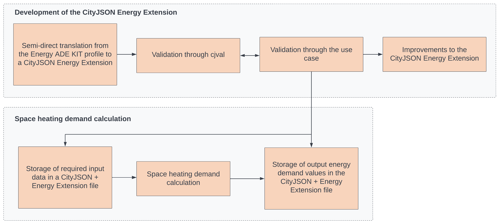
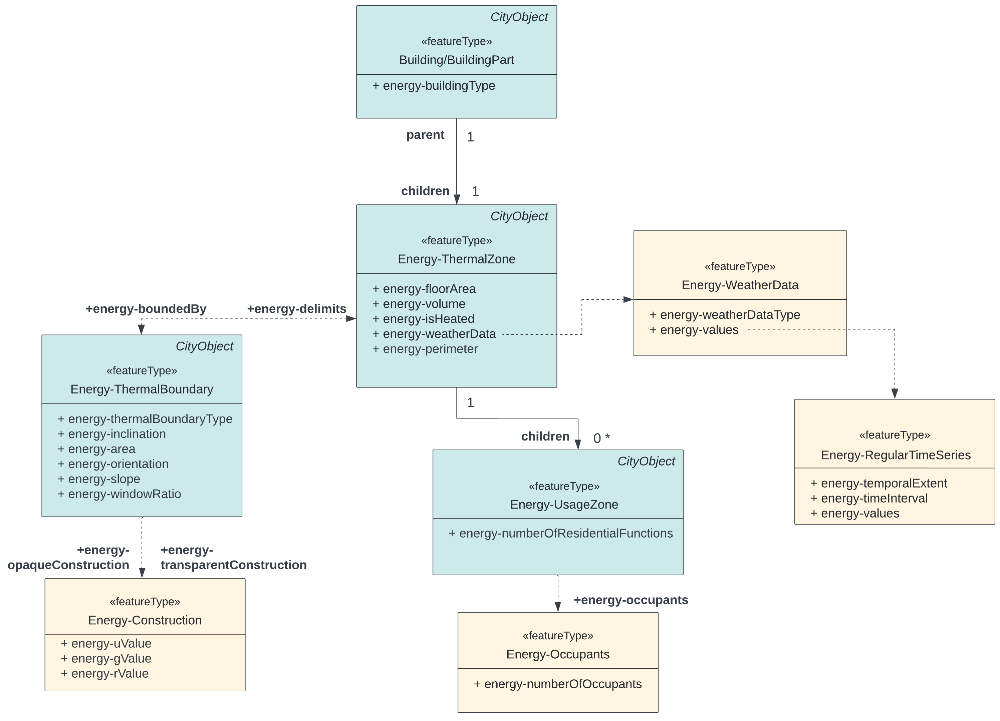

# Development and Testing of the CityJSON Energy Extension for Space Heating Demand Calculation

This repository contains the code developed as part of the MSc thesis of Özge Tufan in Geomatics at TU Delft. The thesis report can be accessed from the [TU Delft repository](https://repository.tudelft.nl/islandora/object/uuid%3A0061d94c-46b6-4910-bb73-b6cdc9b85f84?collection=education). 

## Introduction

3D city models are frequently used to acquire and store energy-related information of buildings to be used in energy applications, such as solar potential analyses and energy demand calculations. In this context, the most common data model is [CityGML](https://www.ogc.org/standards/citygml), which provides an application domain extension called the [Energy ADE](https://github.com/cstb/citygml-energy) to store energy-related data in a systematic manner in XML format. On the other hand, [CityJSON](https://github.com/cityjson/specs) has been developed as a JSON-based encoding to exchange 3D city models, with the aim of eliminating the hierarchical structure and shortcomings of the XML-based CityGML. However, even though an extension mechanism exists in CityJSON, an energy-related CityJSON extension is not present in the current literature. Therefore, the aim of this thesis was to develop and test a CityJSON Energy Extension. To achieve this, the space heating demand calculation of buildings was chosen as the use case to validate and test the Extension.

In this thesis, a simplified version of the Energy ADE, called the Energy ADE KIT profile, was used as the first step to create a semi-direct translation to a CityJSON Energy Extension. After validating the Extension with the official validator of CityJSON, *[cjval](https://github.com/cityjson/cjval)*, the space heating demand was calculated for a subset of the Rijssen-Holten in the Netherlands according to the Dutch standard [NTA 8800](https://www.nen.nl/en/nta-8800-2022-nl-290717). Required input data was collected from various data sources, such as the 3D city model of the area and the [TABULA building physics library](https://webtool.building-typology.eu/#bm), and stored in the CityJSON Energy Extension to test their usability for the use case. The Extension was then improved depending on the results of the tests based on the use case. 

An overview of the methodology is provided in the flowchart below:

<p float="left">
   
</p>

## CityJSON Energy Extension Schema

`schemas/extensions/energy.ext.json` contains the schema of the CityJSON Energy Extension. All three extension properties of CityJSON are used to define new elements, namely *extraAttributes*, *extraCityObjects*, and *extraRootProperties*. Additionally, the *definitions* property of JSON is used to create auxiliary subschemas to define new data types. Examples to each of these properties are given below:

* **extraAttributes**: The *extraAttributes* property is used to define additional attributes for existing CityObjects. For instance, two attributes related to the type and contruction weight of a building are created in the schema as follows: 
```json
"extraAttributes": {
  "Building": {
    "+energy-buildingType": {
      "type": "string"
    },
    "+energy-constructionWeight": {
      "enum": [
        "veryLight",
        "light",
        "medium",
        "heavy"
      ]
    }
  }
}
```
These additional attributes can then be used in a CityJSON + Energy Extension file, and an example is given below:
```json
"CityObjects": {
  "building-1": {
    "type": "Building", 
    "attributes": { 
      "yearOfConstruction": 1982,
      "+energy-buildingType": "singleFamilyHouse",
      "+energy-constructionWeight": "medium"
    }
  }
}
```

* **extraCityObjects**: The *extraCityObjects* property contains both new CityObjects and non-CityObjects defined in the Energy ADE KIT profile. The former use the "allOf" property of JSON to reference the *AbstractCityObject* defined in the core data model of CityJSON, while the latter are simply defined as JSON objects. The definition of a new CityObject (ThermalZone) and a new non-CityObject (Occupants) are shown below:
```json
"extraCityObjects": {
  "+Energy-ThermalZone": {
    "allOf": [
      {
        "$ref": "cityobjects.schema.json#/_AbstractCityObject"
      },
      {
        "properties": {...},
        ...
      }
    ]
  },
  "+Energy-Occupants": {
    "type": "object",
    "properties": {...},
    ...
  }
}

```

* **extraRootProperties**: The units of measurement of numerical attributes are specified as a new root property called "+unitOfMeasurement", as shown below:
```json
"extraRootProperties": {
  "+unitOfMeasurement": {
    "type": "object",
    "properties": {
      "energy-volume": {
        "type": "string",
        "default": "m3"
      },
      "energy-floorArea": {
        "type": "string",
        "default": "m2"
      },
      ...
    }
  }
}
``` 
Depending on the used attributes, the units of measurement can then be specified in a CityJSON + Energy Extension file as follows:
```json
{
  "type": "CityJSON",
  "version": "1.1",
  "extensions": {"Energy": {...}}, 
  "CityObjects": {...}, 
  "transform": {...}, 
  "vertices": [...], 
  "+unitOfMeasurement": {
    "energy-volume": "m3",
    "energy-floorArea": "m2",
    "energy-energyDemand": "kWh",
    ... 
  }
}
```

* **definitions**: The *definitions* property contains new data types as subschemas to be used in Extension objects. An example is given below from the "Energy-FloorArea" type, and how it is referenced in the "energy-floorArea" attribute of Buildings.
```json
"definitions": {
  "Energy-FloorArea": {
      "type": "object",
      "properties": {
        "energy-type": {
          "enum": ["netFloorArea",
                  "grossFloorArea",
                  "energyReferenceArea"
                  ]
        },
        "energy-value": {
          "type": "number"
        }
      },
      "required": ["energy-type", "energy-value"]
    }
},
"extraAttributes": {
  "Building": {
    "+energy-floorArea": {
      "type": "array",
      "items": {"$ref": "#/definitions/Energy-FloorArea"}
    }
  }
}
```
The new data types can then be used in CityJSON + Energy Extension files as follows:
```json
"CityObjects": {
  "building-1": {
    "type": "Building", 
    "attributes": {
      "+energy-floorArea": {{"energy-type": "netFloorArea", "energy-value": 95}}
    }
  }
}
```

**NOTE:** *CodeList* types in the Energy ADE KIT profile were mapped to the CityJSON Energy Extension as simple *string* types since code lists may be determined by users/authorities any time. However, the references to the example code lists included in the KIT profile can be found below for the corresponding attributes. 

* energy-buildingType: http://hub.geosmartcity.eu/registry/codelist/BuildingTypeValue/xsdEncodingRule=iso19136_2007
* energy-energyCarrierType: http://hub.geosmartcity.eu/registry/codelist/EnergySourceValue/xsdEncodingRule=iso19136_2007_ShapeChange_1.0_Extensions
* energy-usageZoneType: http://hub.geosmartcity.eu/registry/codelist/CurrentUseValue/

## Implementation
To validate and test the functionalities of the CityJSON Energy Extension, space heating demand was computed for a subset of Rijssen-Holten in the Netherlands. 

### Datasets

The following datasets were used to obtain all required input data:

* 3D city model of the study area in CityJSON
* [BAG dataset](https://data.overheid.nl/en/dataset/0ff83e1e-3db5-4975-b2c1-fbae6dd0d8e0)
* [Meteorological Data Portal](https://www.tudelft.nl/?id=59090&L=1)
* [TABULA building physics library](https://webtool.building-typology.eu/#bm)

The `data` folder contains all input data required to calculate space heating demand, obtained from the abovementioned datasets.
* `input_data_5_bdg.json` contains the 3D city model of 5 example buildings in CityJSON format. 
* `bag_data.json` contains the building ID (pandid), usable area (sum_oppervlakte), number of accommodations (num_verblijfsobject), and the number of residents per residential function (no_resident) in a building. This data was obtained from the BAG dataset. 
* `building_functions.json` include the building ID (gml_id) and the building functions (citygml_function). 
* `Building_type.csv` contains the typology of each building, such as single family house (SFH), multi-family house (MFH), and terrace house (TH).
* `perimeters.json` includes the building ID (gml_id) and the building perimeter (_perimeter), obtained from the 3D city model through Safe Software FME. 
* `slope_data.json` includes the slope of each building surface, differentiated with unique surface IDs. This data was obtained from the 3D city model through Safe Software FME. 

In addition to the abovementioned data, `energy_demand_db.sql` contains the SQL commands to create a database to store TABULA building physics parameters and the weather data. The SQL script needs to be run after creating a database, which will create three tables: building_data, weather_table, and window_data. To connect to this database during the space heating calculation, the currently empty `database_connection.txt` file needs to be filled with the following parameters in the following format (with space between each parameter):

```
host_name port database_name username password
```

For example:
```
localhost 5432 my_db postgres my_password123
```

### Creating the CityJSON + Energy Extension file
To create the CityJSON + Energy Extension file with all input data, two Python files are used: 
* `store_input.py` : takes all required input data and stores the needed information in a CityJSON + Energy Extension file by using the Extension elements and attributes. The used Extension objects and attributes are shown in the diagram below. It then creates a new directory (`out_data`) to store all output files, and returns the path of the newly created CityJSON + Energy Extension file. 

<p float="left">
   
</p>

* `Mark_buildings.py` : calls `store_input.py`, and uses the output CityJSON + Energy Extension file to eliminate the buildings and surfaces that will not be used in the calculations by performing two operations:

1. For shared WallSurfaces, depending on the value of the adjacent_building_class attribute, an additional Boolean attribute "calculate_energy_demand" is added. This value is set to *yes* if the adjacent building class is not residential, and to *no* if it is residential (zero heat exchange is assumed between adjacent residential buildings). 
2. For each Building or BuildingPart, an additional Boolean attribute "bdg_in_calculation" is added to eliminate the buildings without an LoD2 geometry, and the ones with "has_missing_data" attribute. 

The output is the `out_data/store_input_data_marked.json` file. Therefore, to obtain this file, which is used in the next step, it is sufficient to run `mark_buildings.py`, which itself calls `store_input.py`. 

### Calculating space heating demand
`calculate_energy_demand.py` takes `out_data/store_input_data_marked.json` as input and calculates the space heating demand of all considered buildings in the study area. The calculation is done according to the Dutch norm [NTA 8800](https://www.nen.nl/en/nta-8800-2022-nl-290717) with an energy balance method. The output of the program is the `out_data/output_energy_demand.json` file, which, in addition to the input data, stores the resulting energy demand values for each month with the "+energy-energyDemand" attribute. 


